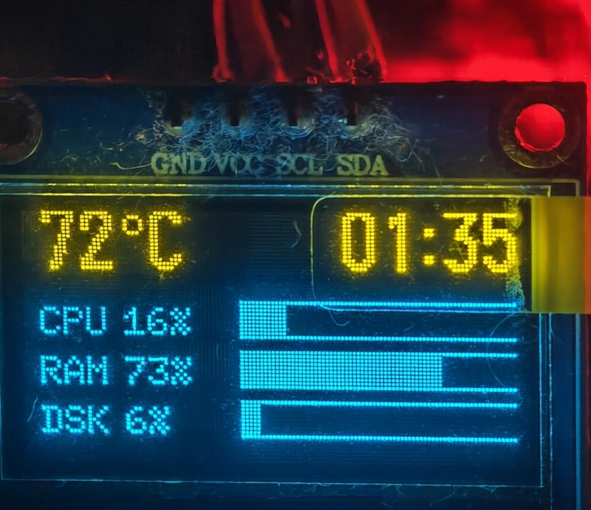
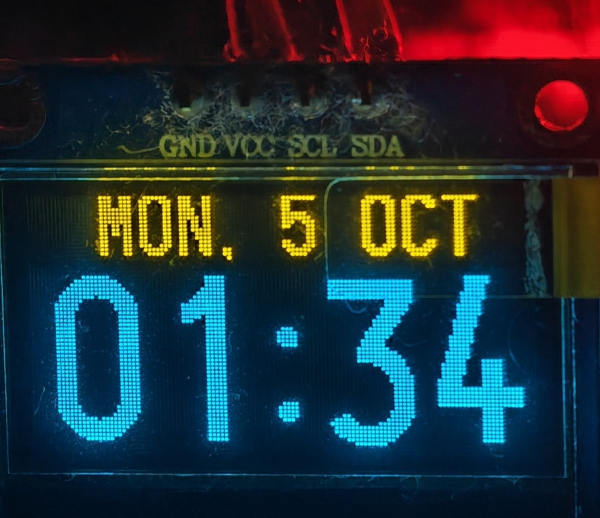
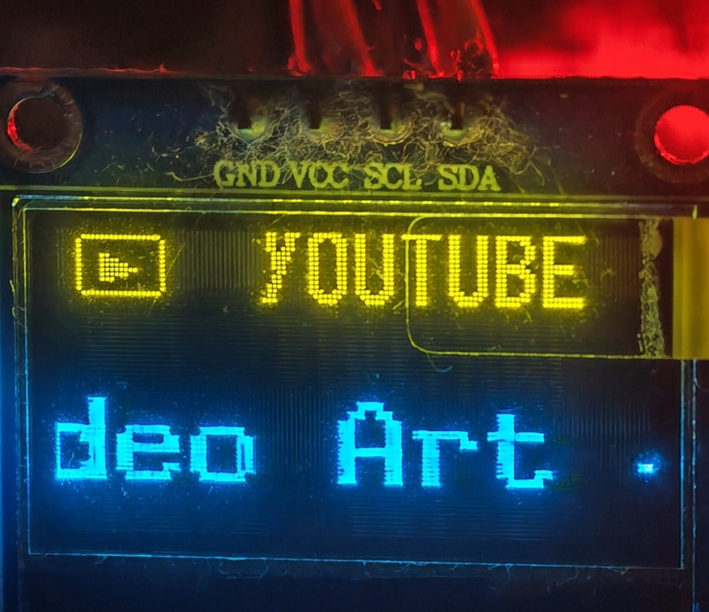
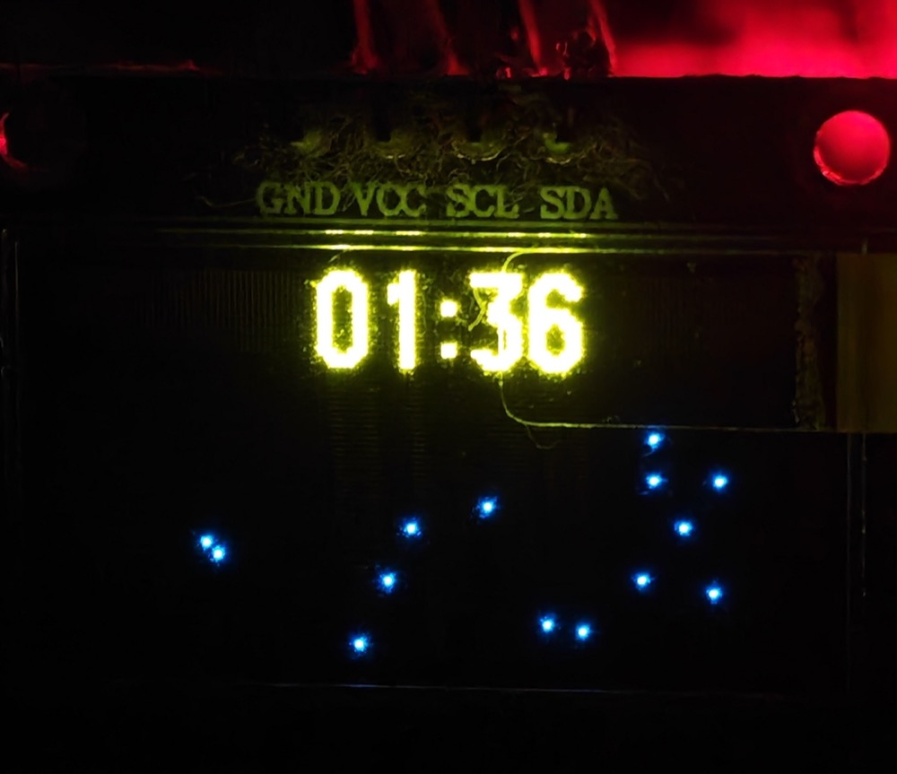

# OLED PC Monitor 0.96″ 128×64

Монитор состояния ПК для двухцветного OLED-дисплея 0.96″ с разрешением 128×64, подключённого к **ESP32-C3**. Верхние 16 пикселей экрана используются как статусная область и прогресс-бар, остальные 48 пикселей — как основная область интерфейса.

Эта версия репозитория предназначена для **macOS** и находится в ветке [`macos-oled128x64`](https://github.com/alex79ven/pc-monitor-esp32/tree/macos-oled128x64). Исходная кроссплатформенная версия для Linux/Omarchy сохранена в ветке [`main`](https://github.com/alex79ven/pc-monitor-esp32/tree/main), а предыдущая macOS-версия для OLED 72×40 — в ветке [`macos`](https://github.com/alex79ven/pc-monitor-esp32/tree/macos).

## Фотографии

Режим мониторинга: температура и время в жёлтой полосе, CPU/RAM/DSK в синей области.



Режим часов при блокировке экрана: дата крупным шрифтом, время — на всю высоту синей области.



Режим YouTube: источник во всю высоту жёлтой полосы, заголовок видео — увеличенным шрифтом.



Режим заставки при простое: только звёзды, время по центру жёлтой полосы.



## Возможности

- CPU, RAM, использование диска и температура CPU;
- часы при выключенном дисплее;
- анимация звёзд при запуске macOS Screen Saver и блокировке экрана;
- OSD громкости и mute;
- OSD яркости дисплея и подсветки клавиатуры;
- OSD медиа-клавиш play/pause, next и previous;
- название текущего трека и заголовок YouTube;
- отправка данных по USB Serial и BLE;
- автоматическое BLE-переподключение;
- восстановление BLE после системного sleep/wake;
- полностью фоновый режим на macOS без окна приложения;
- запуск при входе в macOS через `LaunchAgent`.

## Архитектура

```text
PC (monitor.py + mac_bridge.py + mac_smc.py)
             │
             ├── USB Serial ──┐
             └── BLE / NUS ───┤
                              ▼
                    ESP32-C3 + FreeRTOS
                              │
                              ▼
                    SSD1306 OLED 128×64 (yellow/blue)
```

Прошивка ESP32 принимает короткие текстовые команды и управляет режимами дисплея. Host-приложение на компьютере собирает метрики, следит за системными событиями и отправляет их по последовательному порту или BLE.

## Оборудование

- ESP32-C3;
- OLED SSD1306 0.96″ с разрешением 128×64;
- верхние 16 пикселей дисплея — жёлтая зона, остальные 48 — синяя;
- I²C-дисплей: GPIO 20 (`SDA`) и GPIO 21 (`SCL`);
- если изображение отсутствует, поменяйте `SDA` и `SCL` местами в `platformio.ini`;
- GPIO 20/21 на ESP32-C3 также являются выводами UART0, поэтому Serial использует нативный USB CDC;
- USB-кабель для питания и USB Serial;
- ESP32 с поддержкой BLE.

## Двухцветный интерфейс

Верхние 16 пикселей используются как отдельная статусная область, остальные 48 пикселей — как основная.

- в обычном режиме жёлтая область показывает крупные температуру и время (шрифт 16 px, без разделительной линии), а синяя — CPU, RAM и диск;
- для яркости, клавиатуры и громкости жёлтая область содержит заголовок и прогресс-бар;
- синяя область показывает иконку и крупное значение;
- в режиме Screen Saver звёзды отображаются только в синей области;
- название трека или видео прокручивается в синей области удвоенным шрифтом 12×24;
- для YouTube жёлтая область целиком занята словом `YOUTUBE` шрифтом 16 px, для Spotify — название источника и время.

Если изображение отсутствует или сдвинуто, проверьте вариант `SSD1306 128×64`, I²C-адрес `0x3C` и переключите `SDA`/`SCL` местами.

## Прошивка без PlatformIO

Готовые бинарники лежат в папке [`firmware/`](firmware/). Их можно залить прямо из браузера — без установки PlatformIO, Python и драйверов.

Для ESP32-C3 нужны **три файла с разными адресами**:

| файл | размер | адрес |
|---|---|---|
| [`firmware/bootloader.bin`](firmware/bootloader.bin) | 13 КБ | `0x0` |
| [`firmware/partitions.bin`](firmware/partitions.bin) | 3 КБ | `0x8000` |
| [`firmware/firmware.bin`](firmware/firmware.bin) | 1050 КБ | `0x10000` |

Адрес `bootloader.bin` — **`0x0`**, потому что ESP32-C3 относится к RISC-V-семейству, где загрузчик стоит в начале флеша. У классического ESP32 этот адрес был бы `0x1000`.

> **Внимание:** если плата после прошивки не запускается, проверьте адрес загрузчика. Если инструмент подставил `0x1000` вместо `0x0` — это и есть причина, поправьте вручную.

### Онлайн-флешеры

Все перечисленные работают через Web Serial API прямо в браузере: подключение к плане идёт по USB, данные никуда не отправляются.

| инструмент | ссылка | особенности |
|---|---|---|
| ESP Tool (официальный Espressif) | [espressif.github.io/esptool-js](https://espressif.github.io/esptool-js/) | входит в `esptool-js`, самый надёжный вариант; адреса вводятся вручную |
| ESP Flasher App | [espflasher.app](https://espflasher.app) | сам подбирает адреса по именам файлов, есть просмотр таблицы разделов и встроенный монитор порта |
| ESP Web Tools | [esphome.github.io/esp-web-tools](https://esphome.github.io/esp-web-tools/) | простой интерфейс, подходит для готовых merged-образов |
| ESP Tool Online | [espboards.dev/tools/program](https://espboards.dev/tools/program) | загрузка перетаскиванием, монитор порта, стирание флеша |
| flasher.pro | [flasher.pro](https://flasher.pro) | рассчитан на готовые прошивки Tasmota / ESPHome |
| Web Serial Flasher | [github.com/esptool-js-Web-Based-ESP-Flash-Utility](https://github.com/esptool-js-Web-Based-ESP-Flash-Utility/esptool-js-web-serial-for-W11-10) | самостоятельный HTML-флешер, если официальный вдруг недоступен |

**Требования к браузеру:** Chrome, Edge или Opera версии 89+. Firefox и Safari Web Serial не поддерживают, поэтому эти инструменты в них не заработают.

### Порядок действий (одинаково для всех инструментов)

1. выберите плату **ESP32-C3** и порт, к которому подключён дисплей;
2. подключите три файла с указанными адресами;
3. нажмите **Flash** и дождитесь окончания.

При прошивке через онлайн-флешер BLE-приложение на Mac лучше закрыть: оно занимает соединение с устройством и мешает перезагрузке после прошивки.

Альтернатива — прошивка по USB через `esptool`:

```bash
esptool.py --chip esp32c3 -p /dev/cu.usbmodem14101 -b 460800 write_flash \
  0x0 firmware/bootloader.bin \
  0x8000 firmware/partitions.bin \
  0x10000 firmware/firmware.bin
```

Если что-то пошло не так, восстановить ESP32-C3 можно по USB-кабелю через PlatformIO:

```bash
pio run -t upload --upload-port /dev/cu.usbmodem14101
```

Порт определяется автоматически при подключении платы; если указанный не подходит, посмотрите список устройств:

```bash
ls /dev/cu.usbmodem*
```

## BLE-протокол

Используется Nordic UART Service (NUS):

| Назначение | UUID |
|---|---|
| Service | `6e400001-b5a3-f393-e0a9-e50e24dcca9e` |
| запись host → ESP32 | `6e400002-b5a3-f393-e0a9-e50e24dcca9e` |

Примеры команд:

```text
CPU 24 RAM 63 DISK 41 TEMP 60
BRIGHT 44
KBD 52
VOL 31 MUTE 0
MEDIA 2
NOWPLAY 1 Artist - Title
TIME 23:45:00
STARS
```

## Требования macOS

- macOS 14.5 или новее;
- Python 3.9+ для сборки из исходников;
- Xcode Command Line Tools:

```bash
xcode-select --install
```

Собранная и проверенная версия — x86_64. Для Apple Silicon может понадобиться Rosetta 2 или отдельная universal-сборка.

## Сборка DMG

Из корня репозитория:

```bash
bash host/build_macos.sh
```

Скрипт:

1. создаёт `host/.venv-mac`;
2. устанавливает зависимости из `host/requirements-macos.txt`;
3. собирает приложение через PyInstaller;
4. добавляет Bluetooth usage description и информацию о фоновом режиме;
5. подписывает приложение ad-hoc;
6. создаёт `host/dist/OLED-Monitor.dmg`.

## Установка приложения

Откройте DMG и перетащите `OLED-Monitor.app` в `/Applications`.

Для запуска только по BLE:

```bash
/Applications/OLED-Monitor.app/Contents/MacOS/OLED-Monitor --bt --no-serial
```

Доступные параметры:

```text
--port PORT       выбрать USB Serial-порт
--rate RATE       период отправки метрик, секунд
--bt [NAME]       включить BLE, имя по умолчанию OLED-MONITOR
--no-serial       не использовать USB Serial
```

## Автоматический запуск и фоновый режим

В репозитории есть готовый LaunchAgent:

```text
host/com.user.oledmonitor.plist
```

Он запускает приложение после входа пользователя в macOS, не показывает окно и перезапускает процесс при сбое (`KeepAlive`).

Установка вручную:

```bash
cp host/com.user.oledmonitor.plist \
  ~/Library/LaunchAgents/com.user.oledmonitor.plist

launchctl bootstrap "gui/$(id -u)" \
  ~/Library/LaunchAgents/com.user.oledmonitor.plist
```

Приложение должно находиться по пути:

```text
/Applications/OLED-Monitor.app
```

## Сон и пробуждение

После закрытия крышки macOS может приостановить CoreBluetooth-сессию, при этом приложение или ESP32 иногда ещё считают соединение активным. Host-приложение сравнивает время до и после паузы, принудительно сбрасывает зависший BLE-клиент, повторно использует последний адрес устройства и запускает новый поиск с таймаутами.

Прошивка также отслеживает отсутствие BLE-команд. Если соединение не получает данные в течение 15 секунд, ESP32 сбрасывает состояние подключения и снова начинает BLE-рекламу. Поэтому после изменения прошивки её нужно перезаписать на ESP32.

## Разрешения macOS

При первом запуске разрешите приложению:

- **Bluetooth** — System Settings → Privacy & Security → Bluetooth;
- **Accessibility** — System Settings → Privacy & Security → Accessibility;
- при необходимости **Automation** для Safari.

Accessibility требуется для клавиш громкости, яркости и медиа. Bluetooth необходим для отправки данных на ESP32.

## Температура CPU

На Intel Mac температура читается напрямую через SMC/IOKit, без `sudo` и сторонних утилит. Используется ключ `TC0P`, с fallback на `TC0D`, `TC0H`, `TCXC` и `TCXc`.

Температура отображается в строке метрик и на OLED как:

```text
TMP 60
```

SMC и MediaRemote являются приватными API macOS и могут измениться в будущих версиях ОС.

## YouTube и MediaRemote

Для заголовка используется системный MediaRemote API. Если он недоступен, применяется fallback для активной вкладки Safari. В OLED передаётся только текст, без просмотра истории, аккаунта или содержимого видео.

## Режимы OLED

- **Metrics** — CPU, RAM, диск и температура;
- **Clock** — часы при неактивном экране;
- **Stars** — заставка при Screen Saver или блокировке;
- **Media** — исполнитель и название трека/видео;
- **OSD** — временные уведомления о яркости, клавиатуре, громкости и медиа.

## Структура проекта

```text
src/main.cpp                 прошивка ESP32
platformio.ini               настройки PlatformIO
host/monitor.py              сбор метрик и управление BLE/Serial
host/mac_bridge.py           macOS: яркость, клавиши, Screen Saver, MediaRemote
host/mac_smc.py              чтение температуры Intel Mac через SMC
host/build_macos.sh          сборка DMG
host/com.user.oledmonitor.plist  автозапуск
```

## Linux / Omarchy

Исходная версия находится в ветке `main`. Она сохраняет Linux-ориентированный сценарий:

- MPRIS/playerctl для музыки и видео;
- Hyprland/Omarchy idle и lock;
- sysfs для яркости клавиатуры;
- PulseAudio для громкости;
- Linux `/dev/input` для мультимедийных клавиш.

## Ограничения и безопасность

- BLE-сервис не включает pairing и авторизацию; используйте устройство в доверенной близкой среде;
- macOS privacy permissions могут потребовать повторного разрешения после переустановки или пересборки приложения;
- macOS `MediaRemote`, `DisplayServices` и SMC — приватные интерфейсы;
- macOS DMG собирается с ad-hoc подписью и не проходит Developer ID notarization;
- перед публикацией на других компьютерах может потребоваться ручное разрешение Gatekeeper.

## Проверенная конфигурация

- macOS 14.5;
- Intel MacBook Pro 11,2;
- Python 3.9.6;
- PyInstaller 6.22.x;
- ESP32-C3 с OLED SSD1306 128×64 (верхняя жёлтая зона 16 px, нижняя синяя 48 px);
- BLE-имя `OLED-MONITOR`.

## Лицензия

В репозитории пока не добавлена отдельная лицензия. Перед распространением кода необходимо определить условия лицензирования.
